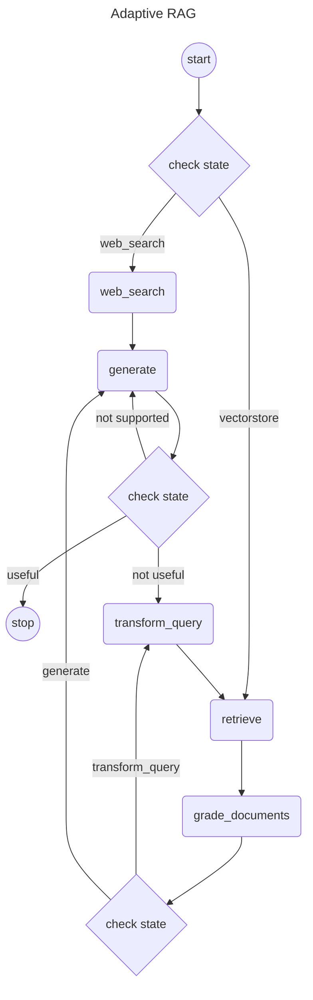

```mermaid
---
title: Adaptive RAG
---
flowchart TD
	__START__((start))
	__END__((stop))
	web_search("web_search")
	retrieve("retrieve")
	generate("generate")
	grade_documents("grade_documents")
	transform_query("transform_query")
	condition1{"check state"}
	condition2{"check state"}
	startcondition{"check state"}
	__START__:::__START__ --> startcondition:::startcondition
	startcondition:::startcondition -->|web_search| web_search:::web_search
	%%	__START__:::__START__ -->|web_search| web_search:::web_search
	startcondition:::startcondition -->|vectorstore| retrieve:::retrieve
	%%	__START__:::__START__ -->|vectorstore| retrieve:::retrieve
	web_search:::web_search --> generate:::generate
	retrieve:::retrieve --> grade_documents:::grade_documents
	generate:::generate --> condition1:::condition1
	condition1:::condition1 -->|not supported| generate:::generate
	%%	generate:::generate -->|not supported| generate:::generate
	condition1:::condition1 -->|not useful| transform_query:::transform_query
	%%	generate:::generate -->|not useful| transform_query:::transform_query
	condition1:::condition1 -->|useful| __END__:::__END__
	%%	generate:::generate -->|useful| __END__:::__END__
	grade_documents:::grade_documents --> condition2:::condition2
	condition2:::condition2 -->|transform_query| transform_query:::transform_query
	%%	grade_documents:::grade_documents -->|transform_query| transform_query:::transform_query
	condition2:::condition2 -->|generate| generate:::generate
	%%	grade_documents:::grade_documents -->|generate| generate:::generate
	transform_query:::transform_query --> retrieve:::retrieve

	classDef ___START__ fill:black,stroke-width:1px,font-size:xx-small;
	classDef ___END__ fill:black,stroke-width:1px,font-size:xx-small;

```